# GitHub diagram formats

This file exercises every diagram format supported by GitHub and Grip.

## Mermaid

The deliberately wide flowchart makes repeated zoom increments easy to verify.

```mermaid
flowchart LR
    A["Receive booking event"] --> B["Validate envelope"]
    B --> C["Load current projection"]
    C --> D["Apply event"]
    D --> E["Persist projection"]
    E --> F["Write outbox record"]
    F --> G["Publish update"]
    G --> H["Refresh cache"]
    H --> I["Notify subscribers"]
    I --> J["Record delivery"]
    J --> K["Update metrics"]
    K --> L["Complete"]
```



## GeoJSON

```geojson
{
  "type": "FeatureCollection",
  "features": [
    {
      "type": "Feature",
      "properties": {"name": "London"},
      "geometry": {
        "type": "Point",
        "coordinates": [-0.1276, 51.5072]
      }
    },
    {
      "type": "Feature",
      "properties": {"name": "Test route"},
      "geometry": {
        "type": "LineString",
        "coordinates": [
          [-0.1276, 51.5072],
          [-0.0877, 51.5074],
          [-0.0015, 51.4779]
        ]
      }
    }
  ]
}
```

## TopoJSON

```topojson
{
  "type": "Topology",
  "transform": {
    "scale": [0.005, 0.005],
    "translate": [-0.2, 51.45]
  },
  "objects": {
    "testArea": {
      "type": "Polygon",
      "properties": {"name": "Test area"},
      "arcs": [[0]]
    }
  },
  "arcs": [
    [[0, 0], [40, 0], [0, 25], [-40, 0], [0, -25]]
  ]
}
```

## STL

```stl
solid tetrahedron
  facet normal 0 0 0
    outer loop
      vertex 0 0 0
      vertex 1 0 0
      vertex 0.5 1 0
    endloop
  endfacet
  facet normal 0 0 0
    outer loop
      vertex 0 0 0
      vertex 1 0 0
      vertex 0.5 0.5 1
    endloop
  endfacet
  facet normal 0 0 0
    outer loop
      vertex 1 0 0
      vertex 0.5 1 0
      vertex 0.5 0.5 1
    endloop
  endfacet
  facet normal 0 0 0
    outer loop
      vertex 0.5 1 0
      vertex 0 0 0
      vertex 0.5 0.5 1
    endloop
  endfacet
endsolid tetrahedron
```
